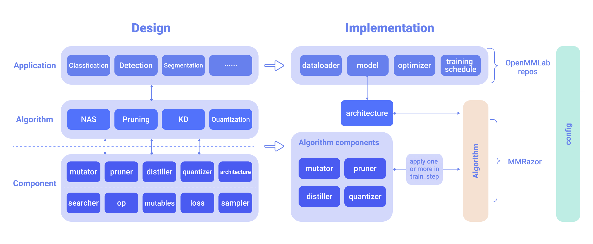

<div align="center">
  
  <div>&nbsp;</div>
  <div align="center">
    <b><font size="5">OpenMMLab website</font></b>
    <sup>
      <a href="https://openmmlab.com">
        <i><font size="4">HOT</font></i>
      </a>
    </sup>
    &nbsp;&nbsp;&nbsp;&nbsp;
    <b><font size="5">OpenMMLab platform</font></b>
    <sup>
      <a href="https://platform.openmmlab.com">
        <i><font size="4">TRY IT OUT</font></i>
      </a>
    </sup>
  </div>
  <div>&nbsp;</div>

<!--算法库 Badges-->

[](https://pypi.org/project/mmrazor)
[](https://mmrazor.readthedocs.io/en/dev-1.x/)
[](https://github.com/open-mmlab/mmrazor/actions)
[](https://codecov.io/gh/open-mmlab/mmrazor)
[](https://github.com/open-mmlab/mmrazor/blob/master/LICENSE)
[](https://github.com/open-mmlab/mmrazor/issues)
[](https://github.com/open-mmlab/mmrazor/issues)

<!--快速链接-->

<!--Note:请根据各算法库自身情况设置项目和链接-->

[📘Documentation](https://mmrazor.readthedocs.io/en/dev-1.x/) |
[🛠️Installation](https://mmrazor.readthedocs.io/en/dev-1.x/get_started/installation.html) |
[👀Model Zoo](https://mmrazor.readthedocs.io/en/dev-1.x/get_started/model_zoo.html) |
[🤔Reporting Issues](https://github.com/open-mmlab/mmrazor/issues/new/choose)

</div>

<!--中/英 文档切换-->

<div align="center">

English | [简体中文](README_zh-CN.md)

</div>

## Introduction

MMRazor is a model compression toolkit for model slimming and AutoML, which includes 3 mainstream technologies:

- Neural Architecture Search (NAS)
- Pruning
- Knowledge Distillation (KD)
- Quantization (come soon)

It is a part of the [OpenMMLab](https://openmmlab.com/) project.

Major features:

- **Compatibility**

  MMRazor can be easily applied to various projects in OpenMMLab, due to the similar architecture design of OpenMMLab as well as the decoupling of slimming algorithms and vision tasks.

- **Flexibility**

  Different algorithms, e.g., NAS, pruning and KD, can be incorporated in a plug-n-play manner to build a more powerful system.

- **Convenience**

  With better modular design, developers can implement new model compression algorithms with only a few codes, or even by simply modifying config files.

Below is an overview of MMRazor's design and implementation, please refer to [tutorials](https://mmrazor.readthedocs.io/en/dev-1.x/get_started/overview.html) for more details.

<div align="center">
  
</div>
<br />

## What's new

MMRazor v1.0.0rc0 was released in 1/9/2022.

Please refer to [changelog.md](/docs/en/notes/changelog.md) for more details and other release history.

## Benchmark and model zoo

Results and models are available in the [model zoo](/docs/en/get_started/model_zoo.md).

Supported algorithms:

<details open>
<summary>Neural Architecture Search</summary>

- [x] [DARTS(ICLR'2019)](configs/nas/mmcls/darts)

- [x] [DetNAS(NeurIPS'2019)](configs/nas/mmdet/detnas)

- [x] [SPOS(ECCV'2020)](configs/nas/mmcls/spos)

</details>

<details open>
<summary>Pruning</summary>

- [x] [AutoSlim(NeurIPS'2019)](/configs/pruning/mmcls/autoslim)

</details>

<details open>
<summary>Knowledge Distillation</summary>

- [x] [CWD(ICCV'2021)](/configs/distill/mmdet/cwd)

- [x] [WSLD(ICLR'2021)](/configs/distill/mmcls/wsld)

- [x] [ABLoss](/configs/distill/mmcls/abloss)

- [x] [BYOT](/configs/distill/mmcls/byot)

- [x] [DAFL](/configs/distill/mmcls/dafl)

- [x] [DFAD](/configs/distill/mmcls/dfad)

- [x] [DKD](/configs/distill/mmcls/dkd)

- [x] [Factor Transfer](/configs/distill/mmcls/factor_transfer)

- [x] [FitNets](/configs/distill/mmcls/fitnets)

- [x] [KD](/configs/distill/mmcls/kd)

- [x] [OFD](/configs/distill/mmcls/ofd)

- [x] [RKD](/configs/distill/mmcls/rkd)

- [x] [ZSKT](/configs/distill/mmcls/zskt)

- [x] [FBKD](/configs/distill/mmdet/fbkd)

</details>

## Installation

MMRazor depends on [PyTorch](https://pytorch.org/), [MMCV](https://github.com/open-mmlab/mmcv) and [MMEngine](https://github.com/open-mmlab/mmengine).

Please refer to [installation.md](/docs/en/get_started/installation.md) for more detailed instruction.

## Getting Started

Please refer to [user guides](https://mmrazor.readthedocs.io/en/dev-1.x/user_guides/index.html) for the basic usage of MMRazor. There are also [advanced guides](https://mmrazor.readthedocs.io/en/dev-1.x/advanced_guides/index.html):

## Contributing

We appreciate all contributions to improve MMRazor.
Please refer to [CONTRUBUTING.md](/docs/en/notes/contribution_guide.md) for the contributing guideline.

## Acknowledgement

MMRazor is an open source project that is contributed by researchers and engineers from various colleges and companies. We appreciate all the contributors who implement their methods or add new features, as well as users who give valuable feedbacks.
We wish that the toolbox and benchmark could serve the growing research community by providing a flexible toolkit to reimplement existing methods and develop their own new model compression methods.

## Citation

If you find this project useful in your research, please consider cite:

```BibTeX
@misc{2021mmrazor,
    title={OpenMMLab Model Compression Toolbox and Benchmark},
    author={MMRazor Contributors},
    howpublished = {\url{https://github.com/open-mmlab/mmrazor}},
    year={2021}
}
```

## License

This project is released under the [Apache 2.0 license](LICENSE).

## Projects in OpenMMLab

- [MMCV](https://github.com/open-mmlab/mmcv): OpenMMLab foundational library for computer vision.
- [MIM](https://github.com/open-mmlab/mim): MIM installs OpenMMLab packages.
- [MMClassification](https://github.com/open-mmlab/mmclassification): OpenMMLab image classification toolbox and benchmark.
- [MMDetection](https://github.com/open-mmlab/mmdetection): OpenMMLab detection toolbox and benchmark.
- [MMDetection3D](https://github.com/open-mmlab/mmdetection3d): OpenMMLab's next-generation platform for general 3D object detection.
- [MMRotate](https://github.com/open-mmlab/mmrotate): OpenMMLab rotated object detection toolbox and benchmark.
- [MMYOLO](https://github.com/open-mmlab/mmyolo): OpenMMLab YOLO series toolbox and benchmark.
- [MMSegmentation](https://github.com/open-mmlab/mmsegmentation): OpenMMLab semantic segmentation toolbox and benchmark.
- [MMOCR](https://github.com/open-mmlab/mmocr): OpenMMLab text detection, recognition, and understanding toolbox.
- [MMPose](https://github.com/open-mmlab/mmpose): OpenMMLab pose estimation toolbox and benchmark.
- [MMHuman3D](https://github.com/open-mmlab/mmhuman3d): OpenMMLab 3D human parametric model toolbox and benchmark.
- [MMSelfSup](https://github.com/open-mmlab/mmselfsup): OpenMMLab self-supervised learning toolbox and benchmark.
- [MMRazor](https://github.com/open-mmlab/mmrazor): OpenMMLab model compression toolbox and benchmark.
- [MMFewShot](https://github.com/open-mmlab/mmfewshot): OpenMMLab fewshot learning toolbox and benchmark.
- [MMAction2](https://github.com/open-mmlab/mmaction2): OpenMMLab's next-generation action understanding toolbox and benchmark.
- [MMTracking](https://github.com/open-mmlab/mmtracking): OpenMMLab video perception toolbox and benchmark.
- [MMFlow](https://github.com/open-mmlab/mmflow): OpenMMLab optical flow toolbox and benchmark.
- [MMEditing](https://github.com/open-mmlab/mmediting): OpenMMLab image and video editing toolbox.
- [MMGeneration](https://github.com/open-mmlab/mmgeneration): OpenMMLab image and video generative models toolbox.
- [MMDeploy](https://github.com/open-mmlab/mmdeploy): OpenMMLab model deployment framework.
