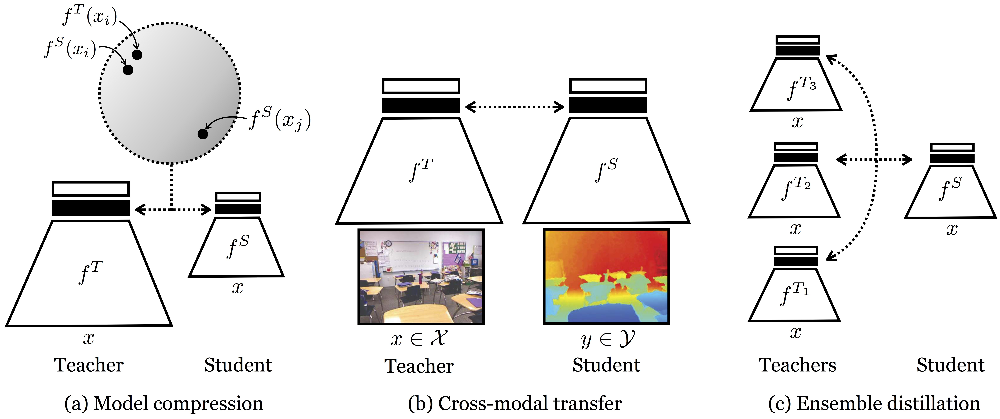

# CONTRASTIVE REPRESENTATION DISTILLATION

> [CONTRASTIVE REPRESENTATION DISTILLATION](https://arxiv.org/abs/1910.10699)

## Abstract

Often we wish to transfer representational knowledge from one neural network to another. Examples include distilling a large network into a smaller one, transferring knowledge from one sensory modality to a second, or ensembling a collection of models into a single estimator. Knowledge distillation, the standard approach to these problems, minimizes the KL divergence between the probabilistic outputs of a teacher and student network. We demonstrate that this objective ignores important structural knowledge of the teacher network. This motivates an alternative objective by which we train a student to capture significantly more information in the teacher’s representation of the data. We formulate this objective as contrastive learning. Experiments demonstrate that our resulting new objective outperforms knowledge distillation and other cutting-edge distillers on a variety of knowledge transfer tasks, including single model compression, ensemble distillation, and cross-modal transfer. Our method sets a new state-of-the-art in many transfer tasks, and sometimes even outperforms the teacher network when combined with knowledge distillation.[Original code](http://github.com/HobbitLong/RepDistiller)



## Citation

```latex
@article{tian2019contrastive,
  title={Contrastive representation distillation},
  author={Tian, Yonglong and Krishnan, Dilip and Isola, Phillip},
  journal={arXiv preprint arXiv:1910.10699},
  year={2019}
}
```

## Results and models

| Dataset | Model     | Teacher   | Top-1 (%) | Top-5 (%) | Configs                                     | Download                                                                                                                                     |
| ------- | --------- | --------- | --------- | --------- | ------------------------------------------- | -------------------------------------------------------------------------------------------------------------------------------------------- |
| CIFAR10 | ResNet-18 | ResNet-50 | 94.79     | 99.86     | [config](crd_neck_r50_r18_8xb16_cifar10.py) | [teacher](https://download.openmmlab.com/mmclassification/v0/resnet/resnet50_b16x8_cifar10_20210528-f54bfad9.pth) \|[model](<>) \| [log](<>) |

## Acknowledgement

Shout out to @chengshuang18 for his special contribution.
