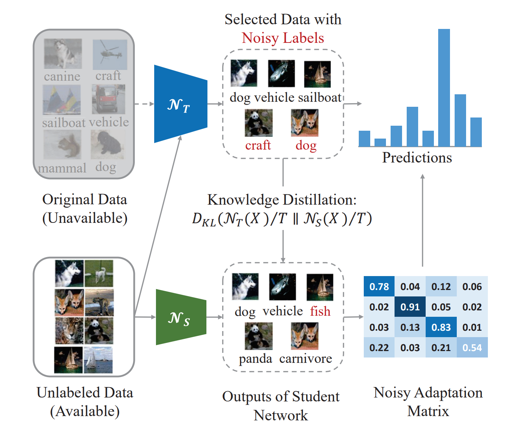

# Learning Student Networks in the Wild (DFND)

> [Learning Student Networks in the Wild](https://openaccess.thecvf.com/content/CVPR2021/papers/Chen_Learning_Student_Networks_in_the_Wild_CVPR_2021_paper.pdf)

<!-- [ALGORITHM] -->

## Abstract

Data-free learning for student networks is a new paradigm for solving users’ anxiety caused by the privacy problem of using original training data. Since the architectures of modern convolutional neural networks (CNNs) are compact and sophisticated, the alternative images or meta-data generated from the teacher network are often broken. Thus, the student network cannot achieve the comparable performance to that of the pre-trained teacher network especially on the large-scale image dataset. Different to previous works, we present to maximally utilize the massive available unlabeled data in the wild. Specifically, we first thoroughly analyze the output differences between teacher and student network on the original data and develop a data collection method. Then, a noisy knowledge distillation algorithm is proposed for achieving the performance of the student network. In practice, an adaptation matrix is learned with the student network for correcting the label noise produced by the teacher network on the collected unlabeled images. The effectiveness of our DFND (DataFree Noisy Distillation) method is then verified on several benchmarks to demonstrate its superiority over state-of-theart data-free distillation methods. Experiments on various datasets demonstrate that the student networks learned by the proposed method can achieve comparable performance with those using the original dataset.



## Results and models

### Classification

|     Location      | Dataset |                                                     Teacher                                                     |                                                     Student                                                     |  Acc  | Acc(T) | Acc(S) |                           Config                            |                                                                                                                                                                                                                                                                                                                                                                                  |
| :---------------: | :-----: | :-------------------------------------------------------------------------------------------------------------: | :-------------------------------------------------------------------------------------------------------------: | :---: | :----: | :----: | :---------------------------------------------------------: | :---------------------------------------------------------------------------------------------------------------------------------------------------------------------------------------------------------------------------------------------------------------------------------------------------------------------------------------------------------------------------------------- |
| backbone & logits | Cifar10 | [resnet34](https://github.com/open-mmlab/mmclassification/blob/master/configs/resnet/resnet34_8xb16_cifar10.py) | [resnet18](https://github.com/open-mmlab/mmclassification/blob/master/configs/resnet/resnet18_8xb16_cifar10.py) | 94.78 | 95.34 | 94.82 | [config](./dfnd_logits_resnet34_resnet18_8xb32_cifar10.py) | [student](https://drive.google.com/file/d/1_MekfTkCsEl68meWPqtdNZIxdJO2R2Eb/view?usp=drive_link) |

## Citation

```latex
@inproceedings{chen2021learning,
  title={Learning student networks in the wild},
  author={Chen, Hanting and Guo, Tianyu and Xu, Chang and Li, Wenshuo and Xu, Chunjing and Xu, Chao and Wang, Yunhe},
  booktitle={Proceedings of the IEEE/CVF Conference on Computer Vision and Pattern Recognition},
  pages={6428--6437},
  year={2021}
}
```
