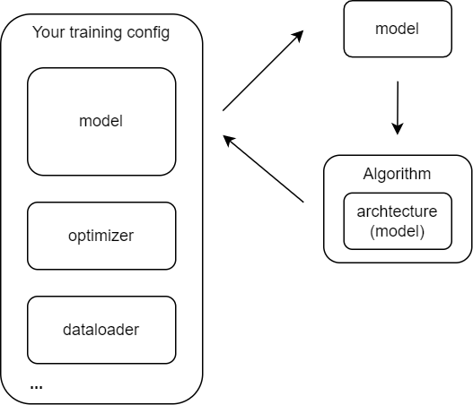

# How to prune your model

## Overview

This section will introduce you to pruning your model.  Before that, we suggest you read the document [User Guides: Pruning Framework](../../user_guides/pruning_user_guide.md) to have an overview of our pruning framework.

First, we suppose your model is defined and trained using one openmmlab repo.
Our pruning algorithms work as a wrapper of a model. To prune your model, you need to replace your model config with our algorithm config, which has a parameter 'architecture' to store your original model. The pipeline is shown below.

<p align='center'></p>

After this replacement, the algorithm will prune your model during your training process.

## How to Config an Algorithm

All pruning algorithms are defined in mmrazor.models.algorithms.pruning. All algorithms have some shared pruning-related arguments, some specific arguments, and some shared mmengine.BaseModel arguments.

Here we take pruning resnet34 using the l1-norm algorithm as an example. We use "mmcls::resnet/resnet34_8xb32_in1k.py" as a base config. Then we override the model config and use the original model config as the architecture of 'ItePruneAlgorithm'.

```python
_base_ = ['mmcls::resnet/resnet34_8xb32_in1k.py']

stage_ratio_1 = 0.7
stage_ratio_2 = 0.7
stage_ratio_3 = 0.7
stage_ratio_4 = 1.0

target_pruning_ratio = {
    'backbone.layer1.2.conv2_(0, 64)_64': stage_ratio_1,
    'backbone.layer1.0.conv1_(0, 64)_64': stage_ratio_1,
    'backbone.layer1.1.conv1_(0, 64)_64': stage_ratio_1,
    'backbone.layer1.2.conv1_(0, 64)_64': stage_ratio_1,
    'backbone.layer2.0.conv1_(0, 128)_128': stage_ratio_2,
    'backbone.layer2.3.conv2_(0, 128)_128': stage_ratio_2,
    'backbone.layer2.1.conv1_(0, 128)_128': stage_ratio_2,
    'backbone.layer2.2.conv1_(0, 128)_128': stage_ratio_2,
    'backbone.layer2.3.conv1_(0, 128)_128': stage_ratio_2,
    'backbone.layer3.0.conv1_(0, 256)_256': stage_ratio_3,
    'backbone.layer3.5.conv2_(0, 256)_256': stage_ratio_3,
    'backbone.layer3.1.conv1_(0, 256)_256': stage_ratio_3,
    'backbone.layer3.2.conv1_(0, 256)_256': stage_ratio_3,
    'backbone.layer3.3.conv1_(0, 256)_256': stage_ratio_3,
    'backbone.layer3.4.conv1_(0, 256)_256': stage_ratio_3,
    'backbone.layer3.5.conv1_(0, 256)_256': stage_ratio_3,
    'backbone.layer4.0.conv1_(0, 512)_512': stage_ratio_4,
    'backbone.layer4.2.conv2_(0, 512)_512': stage_ratio_4,
    'backbone.layer4.1.conv1_(0, 512)_512': stage_ratio_4,
    'backbone.layer4.2.conv1_(0, 512)_512': stage_ratio_4
}

architecture = _base_.model

model = dict(
    _scope_='mmrazor',
    _delete_=True,
    type='ItePruneAlgorithm',
    architecture=architecture,
    mutator_cfg=dict(
        type='BaseChannelMutator',
        channel_unit_cfg=dict(
            type='L1MutableChannelUnit',
            default_args=dict(choice_mode='ratio'))
        parse_cfg=dict(
                type='BackwardTracer',
                loss_calculator=dict(type='ImageClassifierPseudoLoss')),
    target_pruning_ratio=target_pruning_ratio,
    step_epoch=1,
    prune_times=1,
    data_preprocessor=None,
    init_cfg=None
)
```

**Shared pruning-related arguments**: All pruning algorithms have two shared pruning-related arguments.

- Architecture
  - Architecture defines the model to be pruned. Usually, you need to pass your original model config to the argument.
- mutator_cfg
  - The config of a mutator to manage the structure of your model. Usually, each algorithm has a frequently-used mutator. Please refer to the next section for more detail.

**Specific arguments**:
A algorithm may have its specific arguments. You need to read their documents to know how to config. Here, we only introduce the specific arguments of ItePruneAlgorithm.

- target_pruning_ratio: target_pruning_ratio is a dict that uses the name of units as keys and the choice values as values.. It indicates how many channels remain after pruning. You can use python ./tools/pruning/get_channel_units.py --choice {config_file} to get the choice template. Please refer to [How to Use our Config Tool for Pruning](./how_to_use_config_tool_of_pruning.md).
- step_epoch: the step between two pruning operations.
- prune_times: the times to prune to reach the pruning target. Here, we prune resnet34 once, so we set it to 1.

**Shared BaseModel arguments**:
Our algorithms inherit from BaseModel, so each algorithm has shared arguments from BaseModel.

- data_preprocessor:  Used for pre-processing data sampled by dataloader to the format accepted by :meth:`forward`.
- init_cfg: Initialization config dict

## How to Config A Mutator

A mutator is used to manage the structure of a model.

Mutators have two augments:

- channel_unit_cfg: config of channel units. The config should follow the template below.

  ```python
  channel_unit_cfg = dict(
      # type of used MutableChannelUnit
      type ='XxxMutableChannelUnit',
      # default args for MutableChananelUnit
      default_args={},
      units = {
          # config of a unit
          "xxx_unit_name": {
              "init_args":{},
              "channels":{},
          },
          ...
      }
  ),
  ```

  MutableChannelUnit decides how to generate a channel choice. It's important to choose the right MutableChannelUnit. Here, we choose 'L1MutableChannelUnit' to apply the l1-norm algorithm.

- parse_cfg: parse_cfg defines the method to parse the model and get channel units.
  There are three ways used in BaseChannelMutator to parse a model and get MutableChannelUnits.

  1. Using tracer. It needs parse_cfg to be the config of a tracer.
  2. Using config. When parse_cfg\['type'\]='Config'. It needs that channel_unit_cfg\['unit'\]\['xxx_unit_name\] to have a key 'channels' to indicate channel units.
  3. Using the model with pre-defined DynamicOps and MutableChannels: When parse_cfg\['type'\]='Predefined',  the mutator will parse the dynamic ops in the model and get channel units.

In the example above, we directly use a tracer to parse the model.
We also provide a tool for you to configure the mutator, please refer to [How to Use our Config Tool for Pruning](./how_to_use_config_tool_of_pruning.md).
Besides, please refer to [ChannelMutator](../../../../mmrazor/models/mutators/channel_mutator/channel_mutator.ipynb) for more details about ChannelMutator.

## End

After configuring the algorithm, you can rerun the config file with a pretrained checkpoint to prune your model.
