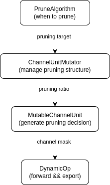

# Pruning Framework

This document represents the framework for pruning in mmrazor.

Pruning framework consists of four core modules: PruneAlgorithm, ChanelUnitMutator, MutableChannelUnit, DynamicOp.
Their main features are detailed below:

| Module             | Features                                                              |
| ------------------ | --------------------------------------------------------------------- |
| PruneAlgorithm     | decides when to prune the model.                                      |
| ChanelUnitMutator  | manages the pruning structure of the model.                           |
| MutableChannelUnit | makes a pruning decision.                                             |
| DynamicOp          | forwards with mutable number of channels, and exports pruned modules. |

## PruneAlgorithm

PruneAlgorithm inherent from BaseAlgorithm, and it decides when to prune the model in training/finetune process.
For example, in ItePruneAlgorithm, model is pruned iteratively by a certain epoch steps.

When a PruneAlgorithm decides to prune a model, a ChanelUnitMutator is used to manage the pruning structure of the model.

## ChanelUnitMutator

The ChanelUnitMutator decides how many channels should each layer prunes. However, as the channels of some layers are related with each other, the related layers share one pruning decision and are managed by a MutableChannelUnit. Therefore, the ChanelUnitMutator directly decides the pruning ratio of each MutableChannelUnit.

## MutableChannelUnit

Each MutableChannelUnit accepts a pruning ratio and generate a channel mask, which is applied to all related DyanmicOps.
All related layers are divided into two types: output_related and input_related.

1. output-related layers accept the channel mask as output mask.
2. input-related layers accept the channel mask as input mask.

## DynamicOP

Dynamic-ops inherit from basic torch module, like nn.Conv2d. They is able to forward with mutable number of channels, and export pruned torch modules.

# How we implement a pruning algorithm by ourself

# How we parse MutableChannelUnits for a model

The section we explain how we parse MutableChannelUnits for a model. The content in this section is a little confusing. Fortunately, you can fluently use our pruning framework even if you don't understand this section.
