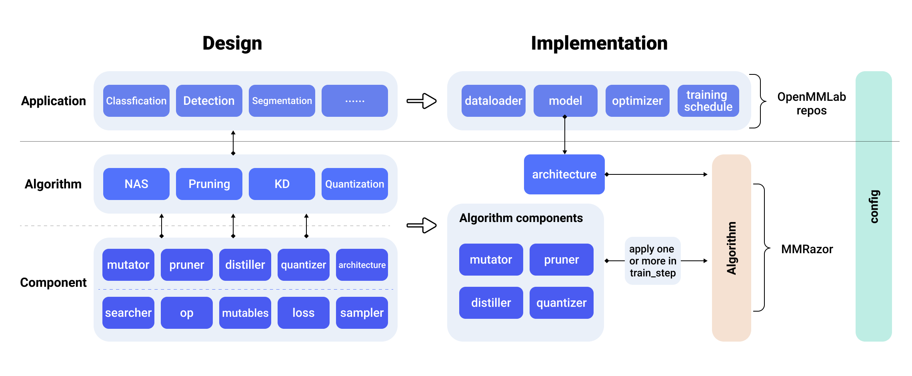
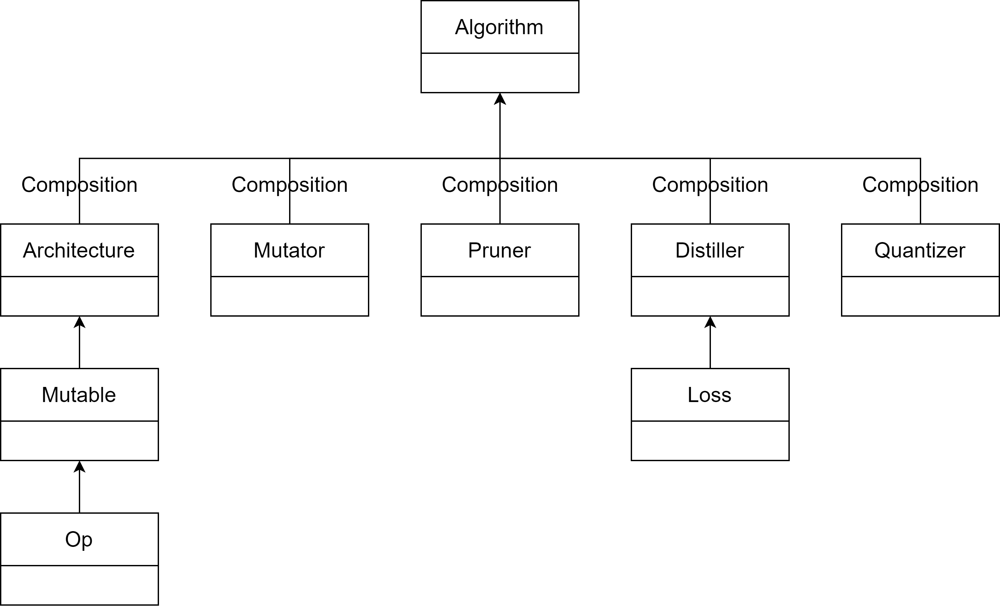

# Tutorial 1: Overview

MMRazor is a model compression toolkit for model slimming and AutoML, which includes 3 mainstream technologies:

- Neural Architecture Search (NAS)
- Pruning
- Knowledge Distillation (KD)
- Quantization (in the next release)

It is a part of the [OpenMMLab](https://openmmlab.com/) project.

## Major features:
- **Compatibility**

  MMRazor can be easily applied to various projects in OpenMMLab, due to the similar architecture design of OpenMMLab as well as the decoupling of slimming algorithms and vision tasks.

- **Flexibility**

  Different algorithms, e.g., NAS, pruning and KD, can be incorporated in a plug-n-play manner to build a more powerful system.

- **Convenience**

  With better modular design, developers can implement new model compression algorithms with only a few codes, or even by simply modifying config files.

## Design and implement

In terms of the overall design, MMRazor mainly includes Component and Algorithm.

Component can be divided into basic component and algorithm component. The basic
component consists of searcher, OP, Mutables and other modules in the figure,
which provides basic function support for algorithm component. Algorithm component
consists of Mutator, Pruner, Distiller and other modules in the figure. They
provide core functionality for implementing various lightweight algorithms.
The combination of Algorithm and Application can realize the purpose of slimming
various task models.

In terms of implementation, MMRazor's algorithm mainly contains two parts, namely
architecture and algorithm components.

Architecture is similar to a model wrapper and can be easily combined with other OpenMMLab repos.

Algorithm components can be flexibly called by each lightweight algorithm. Thanks to the componentization of the algorithm, it can be used alone or in combination in the specific lightweight algorithm. It only needs to rewrite train_step to
realize the specific call logic of algorithm components.

The overall style of MMRazor is same as OpenMMLab . Both of them can flexibly configure the experiment through Config. Config mainly includes two parts, one is specific to MMRazor algorithm, and the other part can reuse the experimental
configuration of other OpenMMLab repos. Including model definition, data processing, training schedule, etc.

Thanks to OpenMMLab powerful and highly flexible config mode and registry mechanism, MMRazor can perform ablation experiments by editing configuration files without changing the code.

## Key Concepts

MMRazor consists of 4 main parts: 1) apis, 2) core, 3) models, 4) datasets. models is the most vital part, whose structure chart is as follows.

- **Algorithm**: Specific implemented algorithm based on specific task, eg: SPOS (Single Path One-Shot Neural Architecture Search with Uniform Sampling) , applying one-shot NAS to classification. Algorithm consists of two main parts: architecture and algorithm components.

- **Architecture**: Model to be slimmed. There are different roles in different algorithm tasks, eg: architecture is supernet in NAS, also student net in KD, and float model in quantization.

- **Algorithm components**: Core functions providers of 4 lightweight algorithms. In each lightweight algorithm, there are serval classes to handle different types.

  - **Mutator**: Core functions provider of different types of NAS, mainly include some functions of changing the structure of architecture.
  - **Pruner**: Core functions provider of different types of pruning, mainly includes some functions of changing the structure of architecture and getting channel group.
  - **Distiller**: Core functions provider of different types of KD, mainly includes functions of registering some forward hooks, calculate the kd-loss and so on.
  - **Quantizer**: Core functions provider of different types of quantization. It will come soon.

- **Base components**: Core components of architecture and some algorithm components
  - **Op**: Specific operation for building search space in NAS, eg: ShuffleBlock 3*3
  - **Mutable**: Searchable op for building searchable architecture in NAS. It mainly consists of op and mask,  and achieving searchable function by handling mask.
  - **Loss**: kd-loss for distiller.
