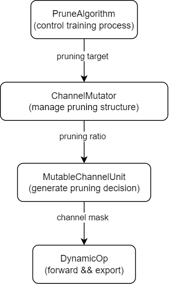
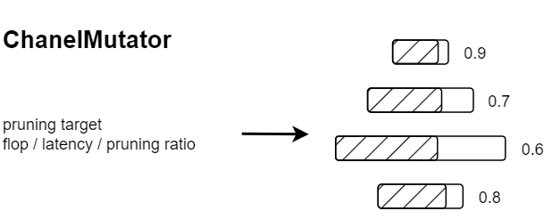
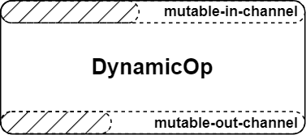

# User Guides: Pruning Framework

## Background

// TODO

## Pruning Framework

This document introduces the pruning framework in mmrazor. Our pruning framework can help you prune a model automatically, making it easy to extend new algorithms.

The pruning framework consists of five modules: Algorithm, ChanelMutator, MutableChannelUnit, MutableChannel, and DynamicOp. Their main features are detailed below:

| Module             | Features                                                              |
| ------------------ | --------------------------------------------------------------------- |
| Algorithm          | Controls training process.                                            |
| ChanelMutator      | Manages the pruning structure of the model.                           |
| MutableChannelUnit | Makes pruning decisions.                                              |
| MutableChannel     | Manage a channel mask.                                                |
| DynamicOp          | Forwards with mutable number of channels, and exports pruned modules. |

<p align="center">
    
</p>

## Algorithm

<p align="center">
    
</p>

Algorithms inherit from BaseAlgorithm. They control the training process, like deciding when to prune the model in the training/finetune process.

For example, IteAlgorithm prunes the model iteratively by certain epochs.

Here is an example of how to use PruneAlgoritm.

```python
from mmrazor.models.algorithms import IteAlgorithm
from mmengine.model import BaseModel
import torch.nn as nn

class Model(BaseModel):
    def __init__(self):
        super().__init__()
        self.conv = nn.Conv2d(3, 8, 3, 1, 1)

    def forward(self, x):
        return self.conv(x)

model = Model()
algorithm = IteAlgorithm(model,
                              mutator_cfg=dict(
                                  type='ChannelMutator',
                                  channl_unit_cfg=dict(type='L1ChannelUnit')),)
print(algorithm)
# IteAlgorithm(
#   (data_preprocessor): BaseDataPreprocessor()
#   (architecture): Model(
#     (data_preprocessor): BaseDataPreprocessor()
#     (conv): DynamicConv2d(
#       3, 8, kernel_size=(3, 3), stride=(1, 1), padding=(1, 1)
#       (mutable_attrs): ModuleDict(
#         (in_channels): MutableChannelContainer(name=, num_channels=3, activated_channels: 3
#         (out_channels): MutableChannelContainer(name=, num_channels=8, activated_channels: 8
#       )
#     )
#   )
#   (mutator): BaseChannelMutator()
# )

```

## ChanelMutator

<p align="center"></p>

A ChanelMutator controls the pruning structure of a model. In other words, ChanelMutator decides how many channels each layer prunes. Usually, given a pruning target, such as a flops, latency, or pruning ratio target, the ChannelUnitMutator will output a pruning structure for the model. The pruning structure is variable. The default definition is the remaining channel ratio, and it's also easy to extend to the number of channels or channel buckets.

As some layers' channels are related, the related layers share one pruning decision. We put these associated layers into a MutableChannelUnit. Therefore, the ChanelMutator directly decides the pruning ratio of each MutableChannelUnit.

```python
from mmrazor.models.mutators import BaseChannelMutator
from mmengine.model import BaseModel
import torch.nn as nn

class Model(BaseModel):
    def __init__(self):
        super().__init__()
        self.feature = nn.Sequential(
            nn.Conv2d(3, 8, 3, 2, 1),
            nn.Conv2d(8, 16, 3, 2, 1)
        )
        self.pool = nn.AdaptiveAvgPool2d(1)
        self.head = nn.Linear(16, 1000)

    def forward(self, x):
        x_ = self.pool(self.feature(x))
        return self.head(x_.flatten(1))

model = Model()
mutator = BaseChannelMutator()
mutator.prepare_from_supernet(model)
print(mutator.sample_choices())
# {
#     'feature.0_(0, 8)_out_1_in_1': 0.5,
#     'feature.1_(0, 16)_out_1_in_1': 0.5625
# }
```

## MutableChannelUnit

<p align="center"></p>

Because some layers' channels are related, the related layers are collected and put in a MutableChannelUnit.

Each MutableChannelUnit accepts a pruning ratio and generates a channel mask for all related layers.

All related layers are divided into two types: output_related and input_related.

- The output channels of output-related layers are in the MutableChannelUnit.
- The input channels of input-related layers are in the MutableChannelUnit.

Besides, basic PyTorch modules are converted to DynamicOps, which can deal with a mutable number of channels with MutableChannels.

## DynamicOP && MutableChannel

<p align="center"></p>

**MutableChannel**: Each MutableChannel manages a channel mask for a model. They help DynamicOps to deal with mutable numbers of channels.

**DynamicOp**: DynamicOps inherit from basic torch modules, like nn.Conv2d or nn.Linear. They can forward with mutable numbers of channels and export pruned torch modules.
Compared with basic torch modules, each DynamicOp has two MutableChannel modules, which control the input and output channels.

## More Documents about Pruning

Please refer to the following documents for more details.

- Development tutorials
  - [How to prune your model](./tutorials/how_to_prune_your_model.md)
  - [How to use config tool of pruning](./tutorials/how_to_use_config_tool_of_pruning.md)
- READMEs
  - [ChannelMutator](./READMEs/channel_mutator.ipynb)
  - [MutableChannelUnit](./READMEs/mutable_channel_unit.ipynb)
