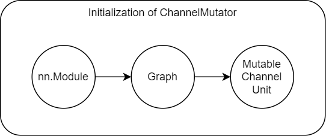

# How to Use our Config Tool for Pruning

## How We Get MutableChannelUnits Automatically

Our pruning framework can automatically parse a model and get MutableChannelUnits.
It makes it easy to prune new models.

The parsing process is placed in ChannelUnitMutator.prepare_from_supernet. We first trace the model and get a graph, then we parse the graph and get MutableChannelUnits.

<p align='center'></p>

## How to Get ChannelUnit Config Template

To make the configuration of ChannelUnit easy, we provide an interface to get the config template: ChannelMutator.config_template(). It returns a config dict. The config\['channel_unit_cfg'\]\['units\] store all parsed MutableChannelUnits.

```python
def config_template(self,
                    only_mutable_units=False,
                    with_unit_init_args=False,
                    with_channels=False):
    """Config template of the mutator.

    Args:
        only_mutable_units (bool, optional): If only return config of
            prunable units. Defaults to False.
        with_unit_init_args (bool, optional): If return init_args of
            units. Defaults to False.
        with_channels (bool, optional): if return channel info.
            Defaults to False.

    Example:
        dict(
            channel_unit_cfg = dict(
                # type of used MutableChannelUnit
                type ='XxxMutableChannelUnit',
                # default args for MutableChananelUnit
                default_args={},
                # config of units
                units = {
                    # config of a unit
                    "xxx_unit_name": {
                        'init_args':{}, # if with_unit_init_args
                        'channels':{} # if with_channels
                    },
                    ...
                }
            ),
            # config of tracer
            parse_cfg={}
        )


    About the detail of the config of each unit, please refer to
    MutableChannelUnit.config_template()
    """
```

Here, we give an example of getting a config template using code.

```python
from mmrazor.models.mutators import ChannelMutator
from torchvision.models import resnet34
model = resnet34()
# initialize a ChannelMutator object
mutator = ChannelMutator(
    channel_unit_cfg=dict(
        type='SequentialMutableChannelUnit',
        default_args=dict(choice_mode='ratio'),
        units={},
    ),
    parse_cfg=dict(
        type='BackwardTracer',
        loss_calculator=dict(type='ImageClassifierPseudoLoss')))
# init the ChannelMutator object with a model
mutator.prepare_from_supernet(model)
config=mutator.config_template(with_unit_init_args=True)
print(config)
# {
#     'type': 'ChannelMutator',
#     'channel_unit_cfg': {
#         'type': 'SequentialMutableChannelUnit',
#         'default_args': {
#             'choice_mode': 'ratio'
#         },
#         'units': {
#             'conv1_(0, 3)_3': {
#                 'init_args': {
#                     'num_channels': 3,
#                     'choice_mode': 'ratio',
#                     ...
#                 },
#                 'choice': 1.0
#             },
#            ...
#         }
#     },
#     'parse_cfg': {
#         'type': 'BackwardTracer',
#         'loss_calculator': {
#             'type': 'ImageClassifierPseudoLoss'
#         }
#     }
# }
```

Besides, it's also easy to initialize a new mutator using the config dict.

```python
# follow the code above
from mmrazor.registry import MODELS
mutator2=MODELS.build(config)
mutator2.prepare_from_supernet(resnet34())
```

To make your development more fluent, we provide a command tool to parse a model and return the config template.

```shell
$ python ./tools/get_channel_units.py -h

usage: get_channel_units.py [-h] [-c] [-i] [--choice] [-o OUTPUT_PATH] config

Get channel unit of a model.

positional arguments:
  config                config of the model

optional arguments:
  -h, --help            show this help message and exit
  -c, --with-channel    output with channel config
  -i, --with-init-args  output with init args
  --choice              output choices template. When this flag is activated, -c and -i will be ignored
  -o OUTPUT_PATH, --output-path OUTPUT_PATH
                        the file path to store channel unit info
```

Take the algorithm Slimmable Network as an example.

```shell
python ./tools/get_channel_units.py ./configs/pruning/mmcls/autoslim/autoslim_mbv2_1.5x_slimmable_subnet_8xb256_in1k.py

# {
#     "type":"SlimmableChannelMutator",
#     "channel_unit_cfg":{
#         "type":"SlimmableChannelUnit",
#         "default_args":{},
#         "units":{
#             "backbone.conv1.conv_(0, 3)_3":{
#                 "choice":3
#             },
#             "backbone.conv1.conv_(0, 48)_48":{
#                 "choice":32
#             },
             ...
#         }
#     },
#     "parse_cfg":{
#         "type":"BackwardTracer",
#         "loss_calculator":{
#             "type":"ImageClassifierPseudoLoss"
#         }
#     }
# }
```

The '-i' flag will return the config with the initialization arguments.

```shell
python ./tools/get_channel_units.py -i ./configs/pruning/mmcls/autoslim/autoslim_mbv2_1.5x_slimmable_subnet_8xb256_in1k.py

# {
#     "type":"SlimmableChannelMutator",
#     "channel_unit_cfg":{
#         "type":"SlimmableChannelUnit",
#         "default_args":{},
#         "units":{
#             "backbone.conv1.conv_(0, 3)_3":{
#                 "init_args":{
#                     "num_channels":3,
#                     "divisor":1,
#                     "min_value":1,
#                     "min_ratio":0.9,
#                     "candidate_choices":[
#                         3
#                     ],
#                     "choice_mode":"number"
#                 },
#                 "choice":3
#             },
#             ...
#         }
#     },
#     "parse_cfg":{
#         "type":"BackwardTracer",
#         "loss_calculator":{
#             "type":"ImageClassifierPseudoLoss"
#         }
#     }
# }
```
